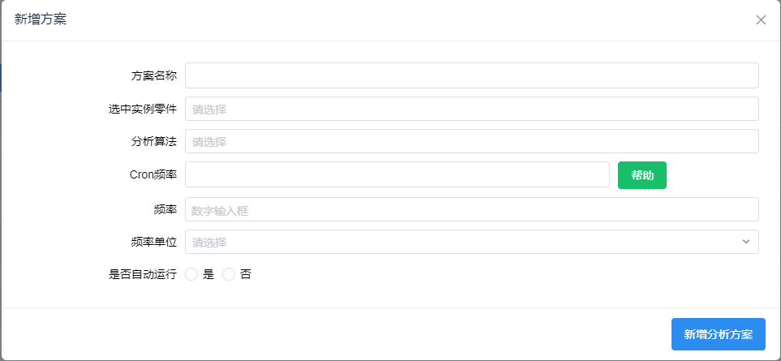

# zhonghe-ASP-2


## 组织结构

0. 说明文档：

[zhonghe-ASP-2](https://github.com/zhonghe-ASP-2/zhonghe-ASP-2)


1. 征兆离散化：

[TimeSeriesMaker](https://github.com/zhonghe-ASP-2/TimeSeriesMaker)： 用于时序数据的生成和测试

[modbus2IoTDB](https://github.com/zhonghe-ASP-2/modbus2IoTDB)：用于模拟机生成的时序数据，并且导入到IoTDB之中

[feature_judge_template](https://github.com/zhonghe-ASP-2/feature_judge_template)：18种征兆判断的具体算法实现

[zhonghe_massive_EDA](https://github.com/zhonghe-ASP-2/zhonghe_massive_EDA)：用于算法的expoloresive data analysis的若干方法，目前使用过一些动态阈值和FFT的检测方法。


2. 规则预警：

[alarm_style](https://github.com/zhonghe-ASP-2/alarm_style)：预警样式

[evidence_reasoning_test](https://github.com/zhonghe-ASP-2/evidence_reasoning_test)： 规则推理覆盖性测试


3. 整体架构：

[zhonghe_reimplementation](https://github.com/zhonghe-ASP-2/zhonghe_reimplementation)：在DWF中运行的整体逻辑和运行环境

[streaming_process](https://github.com/zhonghe-ASP-2/streaming_process)：流式计算的框架，分为IoTDB的trigger处理，producer和consumer

4. 其他：

[measures_hardware](https://github.com/zhonghe-ASP-2/measures_hardware)：~~关于测点的硬件采集方案，从零开始制作~~


备注：

+ pytest的覆盖性测试贯穿在征兆离散化，规则推理和整体流程之中。
+ DWFIO RESTful API 的使用贯穿整个项目中
+ 


## 具体模块说明

###  征兆离散化

周老师负责，具体可见word说明文档和相关的判断流程


### 规则预警

郭老师负责


### 与DWF开发相关


#### 在DWF中整体运行思路

当运行一个检测方案的时候，需要按照下面的步骤对相关的参数进行设置：

1. 标准测点的准备：1RCP604MP, 1RCP606SD, 1RCV036MD, 1RCP609MT, 1RCP610MT,     1RCP606MT, 1RCP607MT
2. FEG树的准备，包括零件-功能-FMECA-征兆（选择关联的中性测点）-规则的顺序进行创建。 征兆上自定义的一些参数( 能否添加一键展开的功能，否则每次逐层的点开比较的繁琐)
3. 实例测点准备，并且创建的时候，选择关联的标准测点。实例测点上自定义的参数606SD测点没有，仅有604配置了测点参数，其余的仅有时序数据路径，但是没有配置时序数据处理参数。

4. 创建实例设备，选择相关的中性零件。实例设备上关联实例测点。（目前都是中性的征兆公用，实例化；若以后有针对性地参数设置，需要在第一步的时候就创建实例的征兆，并且在后续的分析任务的时候，自动判断是否有实例化的征兆，从而选择是中性的征兆进行判断还是实例的征召进行判断）

5. 创建分析算法，上传主函数和配置文件。

6. 创建分析方案，选择相关的实例设备，并且自动化的关联相关的FMECA。

7. 以上步骤全部完成，现在需要调整python的运行流程以及debug，最后产生相关的结果。


#### 定时任务的环境创建



这个界面中，我们需要设置该方案的运行频率。

点击`新增分析方案`按钮后，会创建一个后端的脚本，改脚本仅有一行

```js
 buildEnv(workPath, fmeca_oid_list, instanceOid, taskOid)
```

只不过中间的变量是具体的数据。

定时任务使用的是DWF开发的定时控件，目前使用还有很多的注意点：

1. 不支持参数的定义，只能去运行一个具体名称的后端脚本
2. 开启定时任务的时候，有初始化的状态要是`禁用`，之后再设置`启用`


注意在帮助中选择相应的执行频率的时候，前后字符串不能带有空格。

通过新增分析方案，我们能够创建这个实例设备/零件进行检测的运行环境，如param.xml配置文件，知道使用什么分析算法，算法执行的频率等等。

param.xml中包含有fmeca的个数及fmeca oid列表，实例零件的oid和任务oid。

分析算法目前比较固定，不要轻易进行修改。


在点击`新增分析方案`按钮的瞬间，会做下面的几件事情：

1. 将中性的FMECA递归的进行遍历，并且与方案相关联。
2. 在DWF中创建相应的后端运行脚本，使得定时任务插件能够调度。
3. 通过插件装配，创建相应的定时任务，从而能够调度2中产生的后端脚本。


#### 建立一次分析任务

主要是通过后端脚本的`this.sh.execute()`来调度在服务器端的一个python脚本，整个程序如下：

```js
var Files = Java.type('java.nio.file.Files');
var Paths = Java.type('java.nio.file.Paths');
var StandardCopyOption = Java.type("java.nio.file.StandardCopyOption");

this.logger.info("in houduan createTask");
var obj = JSON.parse(this.customData.customData);
this.logger.info(JSON.stringify(this.obj));
this.logger.info(JSON.stringify(this.customData));
this.logger.info(obj.oid.toString());


function buildEnv(workPath, fmeca_oid_list, instanceOid, taskOid){
    var Files = Java.type('java.nio.file.Files');
    var Paths = Java.type('java.nio.file.Paths');
    var StandardCopyOption = Java.type("java.nio.file.StandardCopyOption");
    var File = Java.type("java.io.File");
    var FileOutputStream = Java.type("java.io.FileOutputStream");
    var SAXReader = Java.type("org.dom4j.io.SAXReader");
    var XMLWriter = Java.type("org.dom4j.io.XMLWriter");
    var OutputFormat = Java.type("org.dom4j.io.OutputFormat");
    this.logger.info("in buildEnv function");
    this.logger.info(workPath);
    // this.logger.info(presages.length.toString());
    // this.logger.info(iotdbPath.length.toString());
    this.logger.info("here00");
    workDirectory = Paths.get(workPath);
    if (Files.notExists(workDirectory)){
        Files.createDirectory(workDirectory);
    }
    this.logger.info("here");
    let targetFileStream  = null;
    let targetWriter = null;
    let dir = Paths.get("/workspace");
    let input = new File(`${dir}${File.separator}param.xml`);
    let inputFile = new File(`${workPath}${File.separator}param.xml`);
    try {
        let reader = new SAXReader();
        let document = reader.read(input);

        // 改写内容
        document.clearContent();
        root = document.addElement("parameters");
        // 写入剖分文件列表
       
        // 写入输出文件
        
        layer1 = root.addElement("param");

        layer1
        .addAttribute("name", "fmecaOID_number")
        .setText(fmeca_oid_list.length.toString());
        this.logger.info("here11");
        for(var i=0; i<fmeca_oid_list.length; i++){
            layer2 = layer1.addElement("fmeca");
            layer2
            .addAttribute("name", "fmecaOID")
            .setText(fmeca_oid_list[i]);
        }

        layer1 = root.addElement("param");

        layer1
        .addAttribute("name", "instanceOid")
        .setText(instanceOid);
        this.logger.info("here11");

        layer1 = root.addElement("param");

        layer1
        .addAttribute("name", "taskOid")
        .setText(taskOid);
        this.logger.info("here11");

        
        // 重新写入param.xml
        let format = OutputFormat.createPrettyPrint();
        targetFileStream  = new FileOutputStream(inputFile);
        targetWriter = new XMLWriter(targetFileStream, format);    
        targetWriter.write(document);

    } catch(ex) {
        this.logger.error(ex.toString());
        this.res = ex.toString();
    } finally{
        this.logger.info("finally");
        if (targetWriter) targetWriter.close();
        if (targetFileStream) targetFileStream.close();
    }
}

nowTime = Date.now().toString();
planPath = Paths.get("/workspace");
planPath = planPath.resolve(obj.FailureAnalysisPlanName.toString());
if (Files.notExists(planPath)){
    Files.createDirectory(planPath);      
}
appPath = Paths.get("/workspace/"+obj.FailureAnalysisPlanName.toString());
appPath = appPath.resolve("Task-"+nowTime);
if (Files.notExists(appPath)){
    Files.createDirectory(appPath);
}

//关联算法文件
if(this.omf.getFilePath(obj.analysisAlgorithm, "AnalysisAlgorithm", "algorithmFile")){
    this.logger.info("have algoritm file");
    let tmpPath = Paths.get(this.omf.getFilePath(obj.analysisAlgorithm, "AnalysisAlgorithm", "algorithmFile"));
    targetPath = planPath.resolve('algorithm.py');
    Files.copy(tmpPath, targetPath, StandardCopyOption.REPLACE_EXISTING);

    this.logger.info(output_log);
    var output_log = appPath.resolve("output.log");
    Files.copy(tmpPath, output_log, StandardCopyOption.REPLACE_EXISTING);
}
if(this.omf.getFilePath(obj.analysisAlgorithm, "AnalysisAlgorithm", "defaultConfig")){
    this.logger.info("have config file");
    let tmpPath = Paths.get(this.omf.getFilePath(obj.analysisAlgorithm, "AnalysisAlgorithm", "defaultConfig"));
    targetPath = planPath.resolve('config.yml');

    //源文件 => 拷贝到 targetPath
    Files.copy(tmpPath, targetPath, StandardCopyOption.REPLACE_EXISTING);

}


// this.omf.handleQueryData(`obj.oid = ${obj.oid}`, "AnalysisAlgorithm");
//更新状态
temp = this.omf.create({sourcePlan:obj.oid, appName: "Task-"+nowTime}, "FailureAnalysisApp");
// this.logger.info(JSON.stringify(temp));
// temp1 = this.omf.handleQueryData(`and obj.oid='${temp.oid}'`, "FailureAnalysisApp");
// this.logger.info(JSON.stringify(temp1));
taskOid = (temp.oid.toString());
var part = this.omf.handleQueryData(`and obj.relation_rightOid = '${obj.oid}'`, "PartToAnanlysisPlan");
this.logger.info(part.length.toString());
partOid = part[0].relation_leftOid;


this.logger.info("!!!!!!!!!");
this.logger.info(taskOid);
this.logger.info(partOid);
if(obj){
    appstatus = "开始运行";
    startTime = nowTime;
    tmp = {
        oid: taskOid,
        appstatus: appstatus,
        startTime: startTime,
        InstancePartOID: partOid
    }
    this.omf.edit(tmp, "FailureAnalysisApp");
    //目前仅有方案的oid,通过方案-FMECA关联找到所有的FMECA
    this.logger.info(obj.FailureAnalysisPlanName.toString());
    var rels = this.omf.handleQueryData(`and obj.relation_leftOid = '${obj.oid}'`, "FailureAnalysisPlanToFMECA");
    this.logger.info(rels.length.toString());
    if(rels.length > 0){
        fmeca_oid_list = [];

        rels.forEach(rel => {
            temp = rel.relation_rightOid.toString();
            fmeca_oid_list.push(temp);
        });
        
        appstatus = "运行中";
        tmp = {
            oid: taskOid,
            appRatio: 0,
            appstatus: appstatus
        }
        this.omf.edit(tmp, "FailureAnalysisApp");
        buildEnv("/workspace/"+obj.FailureAnalysisPlanName.toString()+"/Task-"+nowTime, fmeca_oid_list, partOid, taskOid);
        pythonPath = "/workspace/"+obj.FailureAnalysisPlanName.toString()+"/algorithm.py";
        paramPath = "/workspace/"+obj.FailureAnalysisPlanName.toString()+"/"+"Task-"+nowTime+"/"+"param.xml";
        configPath = "/workspace/"+obj.FailureAnalysisPlanName.toString()+"/config.yml";
        tmp = "/workspace/"+obj.FailureAnalysisPlanName.toString()+"/"+"Task-"+nowTime;
        // this.logger.info(`python3 ${pythonPath} -i ${paramPath} >> "${tmp}/output.log"`);
        // this.sh.execute(`python3 ${pythonPath} -i ${paramPath} >> "${tmp}/output.log"`);
        this.logger.info(`nohup python3 ${pythonPath} -i ${paramPath} -y ${configPath} -o ${tmp}/output_python.log > "${tmp}/output.log" 2>&1 &`);
        this.sh.execute(`nohup python3 ${pythonPath} -i ${paramPath} -y ${configPath} -o ${tmp}/output_python.log > ${tmp}/output.log 2>&1 &`);
        //绑定分析日志到DWF
        // let File = Java.type('java.io.File');
        // var temp = File.createTempFile(taskOid, `${tmp}/output.log`);
        this.omf.setLocalFile(taskOid, "FailureAnalysisApp", "appLog", `${tmp}/output.log`);

    }
    else{
        this.logger.info("该分析方案未配置相关的FMECA，因此无需进行分析");
    }
    appstatus = "运行完成";
    nowTime = Date.now().toString();
    endTime = nowTime;
    tmp = {
        oid: taskOid,
        appstatus: appstatus,
        endTime: endTime,
        appRatio: 100
    }
    this.omf.edit(tmp, "FailureAnalysisApp");
    this.logger.info("执行完毕");
    // 执行脚本算法文件
}
```

主要流程如下：

1. 创建分析任务
2. 将主要的python文件，配置文件复制到指定的目录，比如本环境使用的是`/workspace`目录存储相关的任务运行程序，配置和结果。程序依赖的若干python程序位于`/algorithm`目录之下
3. 创建FMECA相关的配置文件
4. 通过nohup来后台执行一个python程序


其中一次的启动任务命令如下：

```bash
nohup python3 /workspace/主泵机械密封动环磨损失效分析方案0525/algorithm.py 
-i /workspace/主泵机械密封动环磨损失效分析方案0525/Task-1653445132625/param.xml 
-y /workspace/主泵机械密封动环磨损失效分析方案0525/config.yml 
-o /workspace/主泵机械密封动环磨损失效分析方案0525/Task-1653445132625/output_python.log 
> "/workspace/主泵机械密封动环磨损失效分析方案0525/Task-1653445132625/output.log" 
2>&1 &
```

可以抽象成：

```bash
nohup python3 algorithm.py # python文件
-i param.xml # femca，实例零件，任务oid配置
-y config.yml # 算法配置
-o output_python.log # 输出log，并且会重传到DWF中
> output.log" # 标准输出log
2>&1 &
```


也可以配置为:

```bash
python3 algorithm.py # python文件
-i param.xml # femca，实例零件，任务oid配置
-y config.yml # 算法配置
```

将`-o`参数取消，这种形式将输出直接输出到console中，方便进行调试。


可以看到`param.xml`和`config.yml`两个配置文件目前是必须的。


#### python程序

最重要的函数：

```python
def main_process(xml_content, yml_content, dwfio):
    # 征兆判断
    monitor_presages_oid, monitor_presages_whether_reason, monitor_presages_status, instance_presages_oid = feature_judge(
        xml_content, yml_content, dwfio)

    # 规则计算
    calculated_rules, rule_alarms, rule2failuremode, failuremodes, failuremodes_alarm_map = rule_match(
        monitor_presages_oid, monitor_presages_whether_reason, monitor_presages_status, xml_content, yml_content, dwfio)

    # 失效预警, monitor_presages_oid, monitor_presages_status 两个属性捆绑
    # 三类输入：1. 文件, io配置；2. 规则计算结果； 3. 征兆离散化结果
    failuremodes_instance_oid = alarm(xml_content, yml_content, dwfio,
          calculated_rules, rule_alarms, rule2failuremode, failuremodes, failuremodes_alarm_map,
          instance_presages_oid, monitor_presages_oid, monitor_presages_status)

    # 失效传递
    failure_relay(xml_content, yml_content, dwfio, failuremodes, failuremodes_instance_oid)
```


主要进行下面的操作：

1. 征召离散化
2. 规则匹配
3. 失效预警
4. 失效链路传递


实现的过程中加入异常处理将输出写入到output_python.txt中，方便在DWF中下载相关的日志文件，查看执行是否产生错误。


#### 关于预警信息排序方法

```sql
select test.* from (
select max(test."createTime") as "createTime", concat(d.plt_sourceplan, test."InstancePartOID", test."FMECAOID") as "currentProcess" from 
(select a.plt_oid as "oid",a.plt_owner as "owner",a.plt_id as "id",a.plt_lastmodifytime as "lastModifyTime",a.plt_lastmodifier as "lastModifier", cast(a.plt_createtime as timestamp) as "createTime",a.plt_creator as "creator",a.plt_sourceapp as "sourceApp",a.plt_sourcealgorithm as "sourceAlgorithm",a.plt_reason as "reason",a.plt_effectpath as "effectPath",a.plt_faillureanalysisresult as "faillureAnalysisResult",a.plt_alarmtype as "alarmType",a.plt_failurepossibility as "failurePossibility",a.plt_ruleclassinstanceoid as "ruleClassInstanceOID",a.plt_degradationfailuremode as "DegradationFailureMode",a.plt_leafnode as "LeafNode",a.plt_compliancealarm as "complianceAlarm",a.plt_fmecaoid as "FMECAOID", a.plt_red as "red",a.plt_yellow as "yellow",a.plt_white as "white", b.plt_partName as "partOID", c.plt_equipName as "InstancePartOID" ,plt_red as "red",plt_yellow as "yellow",plt_white as "white" from plt_cus_FailureAlarm as a left join plt_cus_NeuralPart as b on a.plt_partOID = b.plt_oid left join plt_cus_InstancePart as c on  a.plt_InstancePartOID = c.plt_oid order by a.plt_createTime desc) 
as test
left join plt_cus_FailureAnalysisApp as d on test."sourceApp" = d.plt_oid group by "currentProcess") as test1, test where test1."createTime"=test."createTime" and test."complianceAlarm" != 'NNN' order by test."createTime" desc
```

通过`concat(d.plt_sourceplan, test."InstancePartOID", test."FMECAOID")`这三个属性，来唯一的确定一条预警记录；

通过`complianceAlarm`属性和时间，来显示最新的一条报警记录。

中间通过若干表连接进行。


#### 定时任务的创建

由于DWF现在的定时任务插件不能带有参数的执行后端脚本，因此需要预先创建一个与分析方案配对的后端脚本，然后将这个后端脚本的名字和定时插件进行绑定，这样才能够针对不同的方案建立不同的定时任务脚本。具体的实现页面可以查看`创建方案`按钮背后的后端脚本实现。

